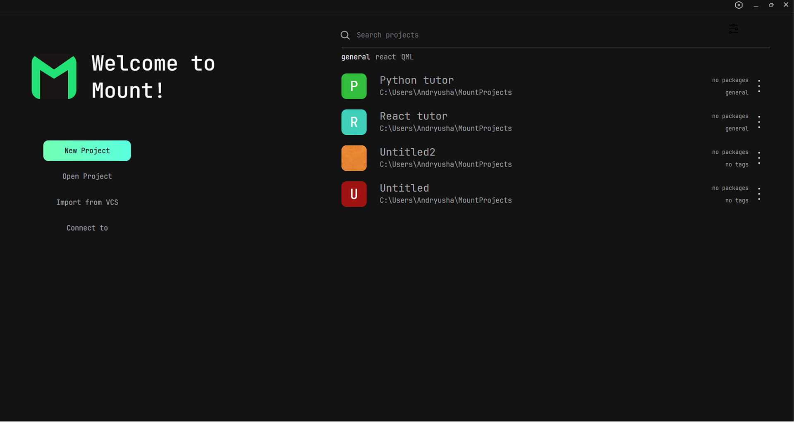

<p align="center">
    
</p>

<div align="center">


</div>
<div align="center"><h1>Mount IDE</h1></div>

An experimental modular integrated development environment where everything needed for development – compilers, LSP,
formatters, debuggers – is managed by a single package system.



# Why Mount

Many code development systems are monolithic and support development specifically in a single area. Even if the opposite
is true, such a program requires extensive configuration and remains very limited nonetheless. Additionally, many
development programs continuously log user actions. This creates an unnecessary additional load on the system.
Mount was created to address these issues.


# Technologies

<div align="center" style="display: flex; justify-content: center">
    <div >
        
        <p style="font-weight: 500;">Tauri</p>
    </div>
    <div>
        
        <p>Rust</p>
    </div>
    <div>
        
        <p>React</p>
    </div>
    <div>
        
        <p>Ts</p>
    </div>
</div>


# How to install

1. Clone repository
```bash
git clone https://github.com/Mount-IDE/Mount.git
cd Mount
```
2. Install dependencies
```bash
npm i
```
3. Compile project
```bash
# dev 
npm run tauri
# release
npm run tauri:release
```

4. Run
```bash
cd src-tauri/target/release
./mount
```

# Roadmap

- [x] Project Creation Menu
- [ ] Project Filtering
- [x] View Project Files
- [x] Terminal
- [x] Project Settings
- [x] Global Settings
- [x] Launch Configurations
- [ ] Package Manager
- [ ] Process Monitor
- [ ] Plugin System

# License

The project is licensed under the [MIT License](./LICENSE)
